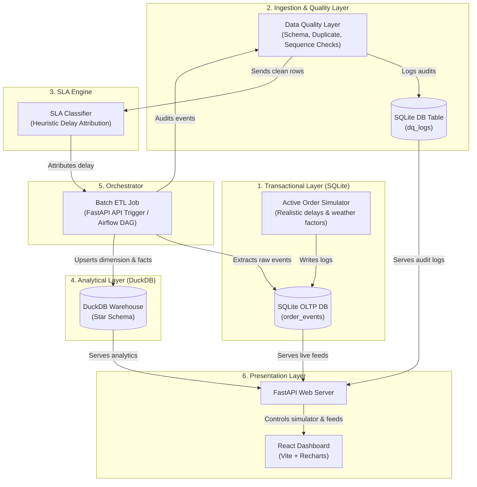

# Delivery SLA & Data Quality Tracker

A modern, production-ready data engineering portfolio project simulating a real-time delivery event stream (similar to Uber Eats or DoorDash), verifying ingestion streams through a custom **Data Quality Layer**, evaluating performance in an **SLA Breach Engine**, and loading structured analytics into a **DuckDB Star Schema (OLAP)**.

The system is complete with a **FastAPI backend**, an interactive **React + Recharts visual dashboard** (designed with a premium Dark-Glassmorphism aesthetic), and standard **Apache Airflow DAG** files for orchestration.

---

## System Architecture



---

## 🚀 Key Architectural Highlights (Interview Talking Points)

### 1. The Data Quality Audit Layer (`dq_layer.py`)
Rather than blindly loading incoming streams, a production-grade data pipeline requires assertions. The pipeline runs **four core validations** before warehouse ingestion:
*   **Mandatory Field Audits**: Checks schema constraints for order/driver/restaurant identifiers.
*   **Duplicate Event Audit**: Detects duplicate state updates in the event stream.
*   **Chronological Timeline Audit**: Ensures timestamps increase sequentially as orders advance.
*   **State Transition Audit**: Enforces lifecycle validity (e.g., preventing an order from jumping directly to `DELIVERED` without a prior `ORDER_PICKED_UP`).
> [!NOTE]
> **Lineage Handling**: Orders failing audits are loaded into the warehouse with a `dq_status = 'FAIL'` flag. This preserves total data lineage for technical audits while keeping operational compliance KPIs skew-free (e.g. `WHERE dq_status = 'PASS'`).

### 2. Heuristic SLA Breach Classifier (`sla_engine.py`)
The SLA engine evaluates each order against a **30-minute total delivery target**. If an order breaches this threshold, the classifier attributes a root-cause category by cross-referencing environmental features:
*   **Weather Delay (Rain/Storm)**: Weather conditions were severe and the transit leg exceeded the 15-minute target.
*   **Peak Demand Delay**: High concurrent volume delayed driver assignment beyond 4 minutes.
*   **Kitchen Operational Delay**: The restaurant preparation exceeded the 15-minute SLA.
*   **Rider Dispatch Delay**: Rider transit to the store exceeded 8 minutes without weather/demand triggers.

### 3. Star Schema Data Warehouse (`warehouse.py`)
Loaded records are structured into an analytical star schema using **DuckDB**, yielding sub-millisecond query performance:
*   `fact_orders`: Central transactional facts storing duration metrics and foreign keys.
*   `dim_customers` / `dim_restaurants` / `dim_riders`: Operational entities.
*   `dim_dates`: Hour-grain calendar dimension mapping day-of-week, hour, and weekend flags.
*   `dim_breach_reasons`: Static breach taxonomy keys (Weather, Kitchen, Rider, Peak Demand).

---

## 🛠 Technology Stack

*   **Backend & Pipelines**: Python 3.13+, FastAPI, DuckDB, SQLite, Pandas, Pytest
*   **Frontend**: React (Vite), Recharts, Lucide Icons, Vanilla CSS
*   **Orchestration & DevOps**: Apache Airflow, Docker Compose, PostgreSQL

---

## 📦 Project Directory Layout

*   [`backend/database/db.py`](file:///Users/srivaishnavikodali/Desktop/projects/Delivery%20SLA%20Tracker/backend/database/db.py): Transactional SQLite storage.
*   [`backend/database/warehouse.py`](file:///Users/srivaishnavikodali/Desktop/projects/Delivery%20SLA%20Tracker/backend/database/warehouse.py): OLAP DuckDB Star Schema setup.
*   [`backend/simulator/order_simulator.py`](file:///Users/srivaishnavikodali/Desktop/projects/Delivery%20SLA%20Tracker/backend/simulator/order_simulator.py): Multi-stage event generator.
*   [`backend/engine/dq_layer.py`](file:///Users/srivaishnavikodali/Desktop/projects/Delivery%20SLA%20Tracker/backend/engine/dq_layer.py): Data Quality checks.
*   [`backend/engine/sla_engine.py`](file:///Users/srivaishnavikodali/Desktop/projects/Delivery%20SLA%20Tracker/backend/engine/sla_engine.py): SLA auditor and breach reason classifier.
*   [`backend/orchestrator/etl.py`](file:///Users/srivaishnavikodali/Desktop/projects/Delivery%20SLA%20Tracker/backend/orchestrator/etl.py): SQLite $\to$ DuckDB batch pipeline.
*   [`backend/orchestrator/airflow_dags/sla_tracker_dag.py`](file:///Users/srivaishnavikodali/Desktop/projects/Delivery%20SLA%20Tracker/backend/orchestrator/airflow_dags/sla_tracker_dag.py): Airflow scheduler job.
*   [`backend/api/main.py`](file:///Users/srivaishnavikodali/Desktop/projects/Delivery%20SLA%20Tracker/backend/api/main.py): FastAPI server.
*   [`backend/tests/`](file:///Users/srivaishnavikodali/Desktop/projects/Delivery%20SLA%20Tracker/backend/tests/): Unit & Integration test suites.
*   [`frontend/src/`](file:///Users/srivaishnavikodali/Desktop/projects/Delivery%20SLA%20Tracker/frontend/src/): React dashboard source.

---

## 🏃 Run Guide

### 1. Setup Environment & Databases
From the project root:
```bash
# Install Python packages
python3 -m pip install -r requirements.txt

# Install Node modules
cd frontend && npm install && cd ..
```

### 2. Launch the Application

Start the **FastAPI Backend Server** (Port 8000):
```bash
python3 -m uvicorn backend.api.main:app --reload
```

In a separate terminal, launch the **React Frontend Server** (Port 5173):
```bash
cd frontend
npm run dev
```
Open [http://localhost:5173](http://localhost:5173) in your browser.

### 3. Verify End-to-End Pipeline
Use the dashboard interface to:
1.  **Toggle the Simulator**: Turn it on, increase clock speed, and select "Rain" or "Storm".
2.  **Verify Event Streams**: Watch the "Live Ingestion Logs" fill up with order lifecycle updates.
3.  **Run ETL Batch Sync**: Press the "Trigger ETL Pipeline" button.
4.  **Analyze Analytics**: Check the interactive line charts showing compliance rates and bar charts detailing SLA breaches (confirming that "Weather Delays" or "Peak Demand" matches your simulator's configurations).

### 4. Run Test Suite
```bash
pytest backend/tests/
```
All 9 unit and integration tests should pass successfully.
